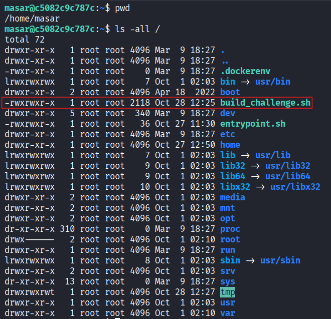
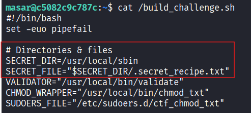
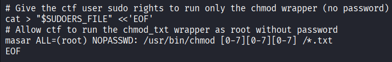
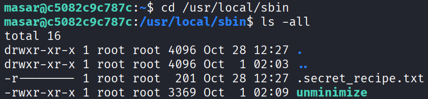
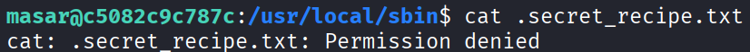
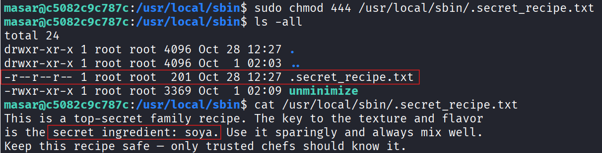
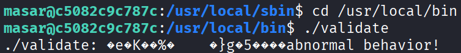

# Exercise Two Report

## Goal
Find the hidden `.txt` file, read the secret ingredient, and use it with `validate`.

## Steps

### 1) Look around the filesystem
I started by checking the root directory:

```bash
pwd
ls -la /
```


I noticed a readable file called `build_challenge.sh`, so I opened it:

```bash
cat /build_challenge.sh
```



From that file I learned two important things:

- the secret file is `/usr/local/sbin/.secret_recipe.txt`
- the user `masar` is allowed to run `chmod` on `.txt` files with `sudo`

### 2) Go to the secret file
I moved to the directory and listed hidden files:

```bash
cd /usr/local/sbin
ls -all
```


That showed the hidden file:

```text
.secret_recipe.txt
```

### 3) Try to read it
First I tried reading it directly:

```bash
cat .secret_recipe.txt
```


It failed because the file was owned by `root` and not readable by my user.

### 4) Change the permission and read it
Based on what I saw in `build_challenge.sh`, I used the allowed `chmod` command with `sudo`:

```bash
sudo chmod 444 /usr/local/sbin/.secret_recipe.txt
cat /usr/local/sbin/.secret_recipe.txt
```


That revealed the secret ingredient:

```text
soya
```

### 5) Validate step
I then moved to `/usr/local/bin` and tried to run the validator:

```bash
cd /usr/local/bin
./validate
```


But in this container, the shipped `validate` binary was broken and returned an `abnormal behavior!` error instead of prompting for input.

I confirmed the intended validator logic by reading `build_challenge.sh`. The script clearly checks whether the answer contains `soya`, and if it does, it prints a flag in this format:

```text
FLAG{<random-uuid>}
```

So the intended final answer for the validator input is:

```text
soya
```

## Conclusion
I solved the permission part of the challenge by reading the build script, locating the hidden file, using the allowed `sudo chmod` capability, and reading the protected `.txt` file. The secret ingredient was `soya`.

The only issue was that the provided `validate` binary in this container was broken, but the readable challenge script showed exactly how validation was supposed to work.

## Commands I actually used
```bash
pwd
ls -la /
cat /build_challenge.sh
cd /usr/local/sbin
ls -all
cat .secret_recipe.txt
sudo chmod 444 /usr/local/sbin/.secret_recipe.txt
cat /usr/local/sbin/.secret_recipe.txt
cd /usr/local/bin
./validate
```

## Final note
I successfully retrieved the secret ingredient (`soya`) by leveraging the allowed `sudo chmod` permission on `.txt` files, but the provided `validate` binary in the container was broken and returned `abnormal behavior!` instead of accepting input.
