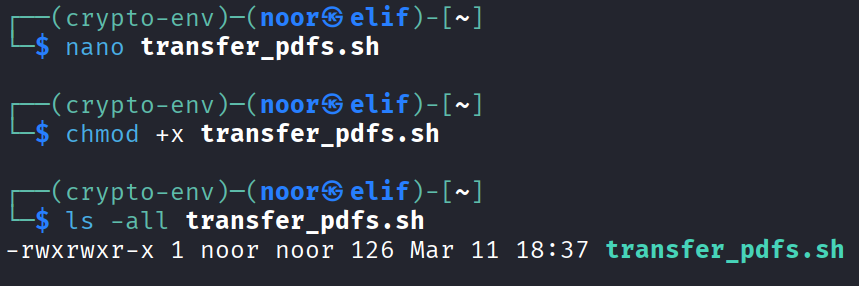
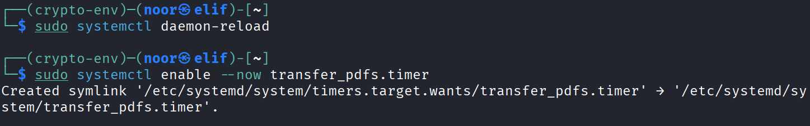
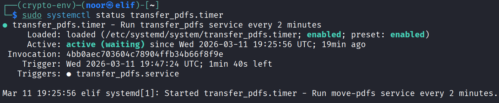
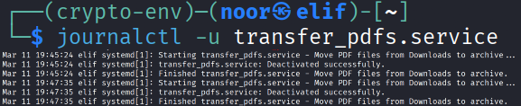
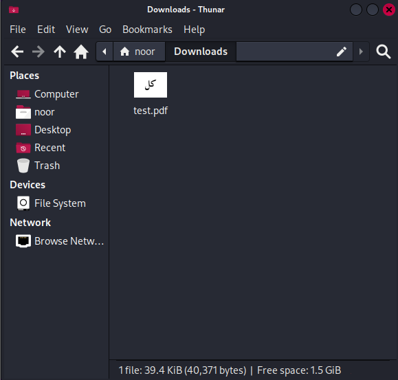
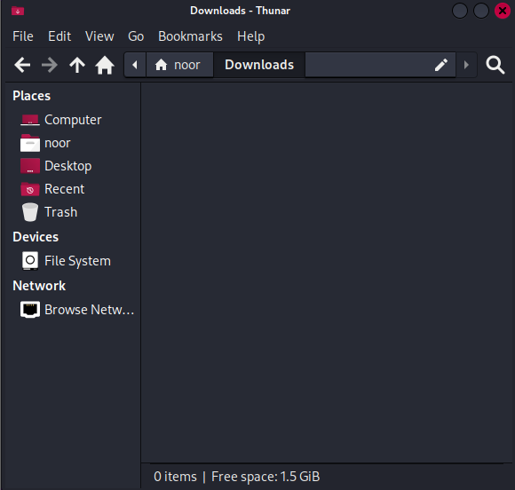
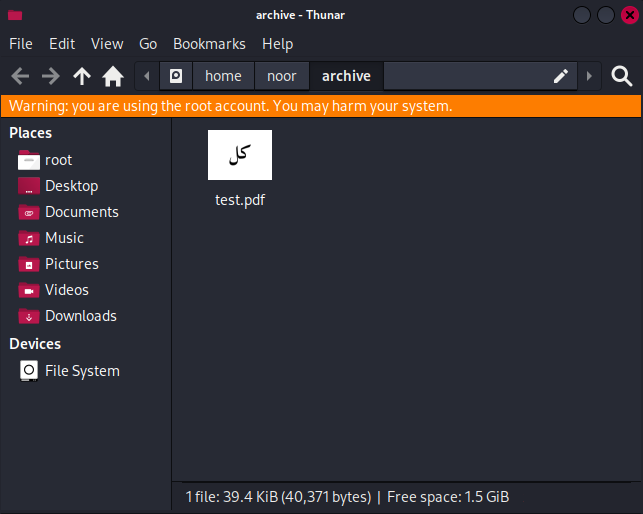

# Exercise Report

## Goal

I created a systemd-based solution checks for all `pdf` files inside `~/Downloads` directory and moves them to `$HOME/archive` every 2 minutes.

## Step 1: Create the script

First, I created a bash script that checks for PDF files inside `~/Downloads` and moves them to `$HOME/archive`.

File:

```bash
nano transfer_pdfs.sh
```

Script content:

```bash
#!/bin/bash
mkdir -p "$HOME/archive"
find "$HOME/Downloads" -maxdepth 1 -type f -name "*.pdf" -exec mv {} "$HOME/archive/" \;
```

After that, I made it executable, then check it's permissions:

```bash
chmod +x transfer_pdfs.sh
ls -all transfer_pdfs.sh
```



## Step 2: Create the systemd service file

Then I created a service file:

```bash
sudo nano /etc/systemd/system/transfer_pdfs.service
```

Service content:

```ini
[Unit]
Description=Move PDF files from Downloads to archive

[Service]
Type=oneshot
ExecStart=$HOME/transfer_pdfs.sh
```


## Step 3: Create the systemd timer file

Since I needed the task to run every 2 minutes, I used a **systemd timer**.

```bash
sudo nano /etc/systemd/system/transfer_pdfs.timer
```

Timer content:

```ini
[Unit]
Description=Run transfer_pdfs service every 2 minutes

[Timer]
OnBootSec=2min
OnUnitActiveSec=2min
Unit=transfer_pdfs.service

[Install]
WantedBy=timers.target
```


## Step 4: Reload systemd and enable the timer

After creating both files, I reloaded systemd and enabled the timer:

```bash
sudo systemctl daemon-reload
sudo systemctl enable --now transfer_pdfs.timer
```



## Step 5: Check that it is working

To verify everything, I checked the timer status:

```bash
sudo systemctl status transfer_pdfs.timer
```



I also checked the service logs if needed:

```bash
journalctl -u transfer_pdfs.service
```



## Downloads directory before



## Downloads directory after



## Archive directory after transferring



## How the solution works

* The script checks `~/Downloads` for any file ending with `.pdf`.
* If it finds any PDF files, it moves them to `$HOME/archive`.
* The timer runs the service every 2 minutes.
* This avoids using cron jobs and uses systemd as the alternative scheduler.

## Files I created

### 1) Script file

`transfer_pdfs.hs`

### 2) Service file

`/etc/systemd/system/transfer_pdfs.service`

### 3) Timer file

`/etc/systemd/system/transfer_pdfs.timer`

## Final commands summary

```bash
nano transfer_pdfs.sh
chmod +x transfer_pdfs.sh
ls -all transfer_pdfs.sh
sudo nano /etc/systemd/system/transfer_pdfs.service
sudo nano /etc/systemd/system/transfer_pdfs.timer
sudo systemctl daemon-reload
sudo systemctl enable --now transfer_pdfs.timer
sudo systemctl status transfer_pdfs.timer
journalctl -u transfer_pdfs.service
```

## Conclusion

I solved the task by using a **bash script + systemd service + systemd timer**. The timer runs every 2 minutes, checks for PDF files in `~/Downloads`, and moves them to `$HOME/archive` without using cron jobs.
